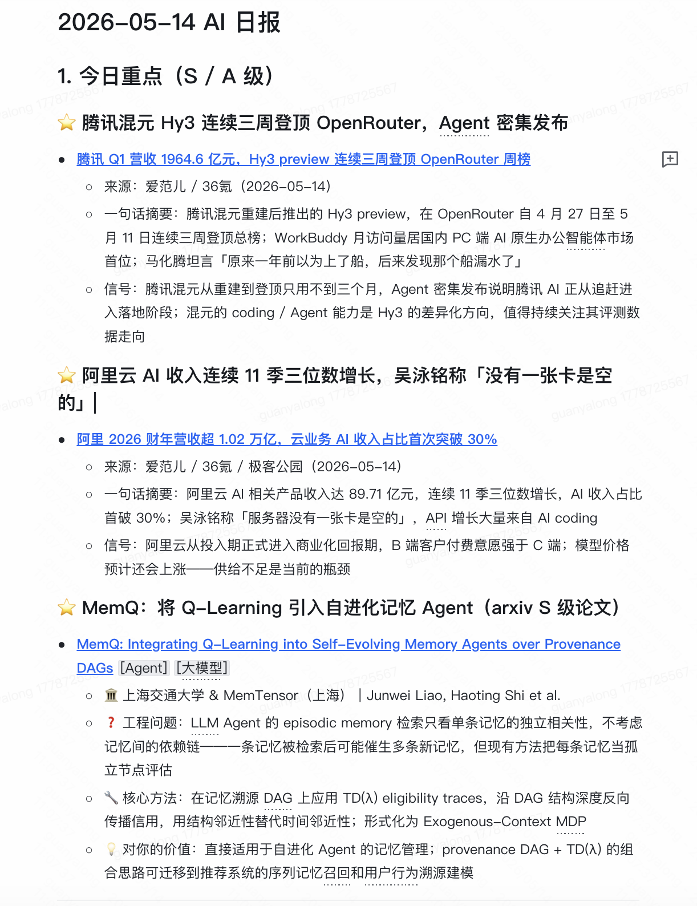

# personal-daily-digest

> 面向算法工程师的个人 AI 日报 Skill，为 MyFlicker 智能助手设计。

---

## 📸 效果展示

以下是一份真实生成的日报示例（2026-05-14）：



**日报包含：**
- 🌟 **今日重点（S/A 级）**：腾讯混元 Hy3 登顶 OpenRouter、阿里云 AI 营收连续三位数增长等热点
- 📄 **arxiv 论文精选**：带机构、工程问题、核心方法、价值判断的结构化摘要
- 📰 **算法 & 科技快讯**：36Kr / 爱范儿 / 极客公园等多源覆盖

> 💡 每天 09:00 自动生成并推送，无需人工干预。

## 功能概述

每天自动从多个信息源聚合内容，完成排序、去重、分层摘要，生成结构化日报，写入快手 Docs 并通过 KIM 推送卡片消息。

**核心特点：**
- 📰 多源聚合：arxiv / GitHub / OpenAI / The Verge / 36Kr / 极客公园 / 爱范儿 / MIT News
- 🏛️ 机构自动补全：去 `arxiv.org/html/{id}` 抓取作者机构（比 RSS 更准确）
- 🔁 增量去重：48h 注册表，不重复推送
- 🧠 工程视角摘要：不翻译 abstract，直接说「解决什么工程问题 / 核心方法 / 对你有什么用」
- 📄 快手 Docs 归档 + KIM 卡片推送（含文档链接）

---

## 日报结构

```
1. 今日重点（S/A 级精选）
2. arxiv 论文精选（Top 10，工程视角摘要 + 机构）
3. 算法与 AI 动态
4. 科技快讯（全量覆盖，按源分组）
5. 宏观科技信号
6. 我的观察
7. 元信息（来源统计、去重数量）
```

---

## 目录结构

```
personal-daily-digest/
├── SKILL.md                    # 技能主文件，MyFlicker 读取执行
├── manifest.json               # 技能元数据
├── README.md                   # 本文件
├── dedup_registry.json         # 去重注册表（运行时生成，不提交 git）
├── reference/
│   ├── default-sources.md      # 信息源配置（RSS URL、关键词、权重）
│   ├── daily-template.md       # 日报模板（7 节结构 + 格式规范）
│   └── roadmap.md              # 待办与优化计划
└── scripts/
    ├── fetch_arxiv.py          # 抓取 arxiv cs.IR / cs.AI + 机构补全
    ├── fetch_cn_news.py        # 抓取 36Kr / 极客公园 / 爱范儿
    ├── fetch_github_releases.py # 抓取 GitHub Releases
    ├── fetch_rss.py            # 通用 RSS 抓取
    ├── generate_digest.py      # 生成日报 Markdown
    ├── dedup_items.py          # 去重注册表管理
    └── llm_call.py             # LLM 调用封装
```

---

## 执行流程（11 步）

| Step | 内容 |
|---|---|
| 1 | 加载 `reference/default-sources.md` 源池配置 |
| 2 | 加载 `dedup_registry.json`，获取 48h 内已推送条目 |
| 3 | 并行抓取各源候选内容 |
| 4 | 与注册表比对，过滤已推送条目 |
| 5 | 逐篇去 `arxiv.org/html/{id}` 补全机构信息（串行，2s 间隔） |
| 6 | 关键词过滤 + 打分排序（推荐/检索/大模型优先） |
| 7 | 按模板生成完整日报 Markdown |
| 8 | 写入快手 Docs |
| 9 | 发 KIM 卡片给个人/群组 |
| 10 | 追加本次入选条目到去重注册表 |
| 11 | 本地归档至 `daily-digest/archive/YYYY-MM-DD/` |

---

## 信息源

| 源 | 类型 | 分类 |
|---|---|---|
| arxiv cs.IR | RSS | 论文（推荐/检索/RAG） |
| arxiv cs.AI | RSS | 论文（AI 方法/对齐） |
| OpenAI Blog | RSS | AI 动态 |
| The Verge AI | RSS | 科技快讯 |
| MIT News AI | RSS | 学界动态 |
| 36Kr | RSS | 国内科技快讯 |
| 极客公园 | RSS | 国内科技快讯 |
| 爱范儿 | RSS | 消费科技 |
| GitHub Releases | API | 工具更新（vLLM / Transformers / LangChain 等） |

---

## 论文摘要格式

```
🏛️ 香港城市大学 & 清华大学｜Ziwei Liu et al.
- ❓ 工程问题：生成式推荐冷启动命中率低
- 🔧 核心方法：语义 token 替代 ID + contrastive 对齐
- 💡 对你的价值：可直接用于快手冷启动推荐场景
[论文链接](https://arxiv.org/abs/2605.11447)
```

**重要规范：**
- 机构优先级 > 作者名，放第一行
- 不翻译 abstract，直接说工程意义
- 机构从 `arxiv.org/html/{id}` 抓取，不用 RSS（RSS 里没有机构信息）
- arxiv Atom API 的 `<arxiv:affiliation>` 字段不可靠（作者可选填），不要用

---

## 去重机制

- 注册表文件：`dedup_registry.json`
- Key 格式：`arxiv:{id}` / `url:{url}` / `github:{repo}:{tag}`
- 过期时间：48h（防止跨天重复）
- 过期条目自动清理

**⚠️ 注意：`dedup_registry.json` 是运行时状态文件，不提交到 git。**

---

## 定时任务

每天 09:00（Asia/Shanghai）自动执行，推送给：
xxx

---

## 触发词

在 MyFlicker 中说以下任意一句即可触发：

- 「生成日报」
- 「今天有什么值得看」
- 「跑一次科技日报」
- 「看看 AI 和科技快讯」
- 「给我今天的情报」
- 「daily digest」

---

## 已知问题 & 待优化

详见 `reference/roadmap.md`

- [ ] 少数 arxiv 论文 `/html/` 页面机构在 authors 字段内嵌，`affiliations` 列表为空，需要从 authors 文本里解析
- [ ] Anthropic Blog 暂无稳定 RSS，用页面抓取代替
- [ ] 科技快讯源可继续扩充（InfoQ、Tech Crunch 等）
